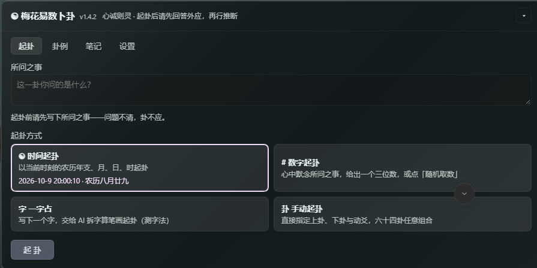
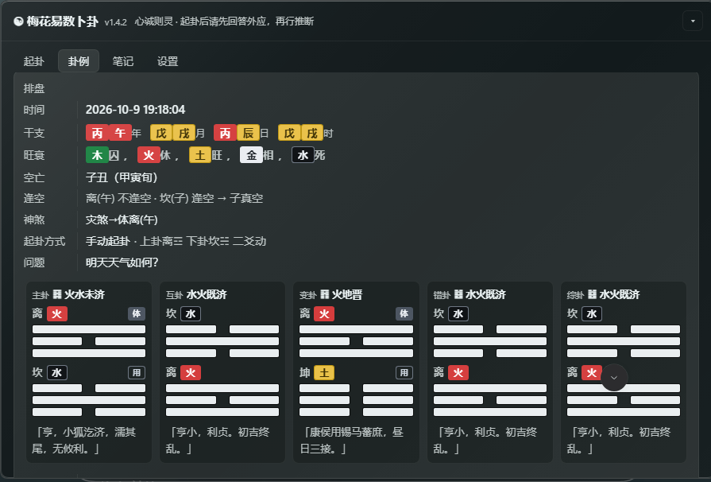

# 梅花易数卜卦 · dsh-meihuayi

> A DeepSeek Harness plugin for 梅花易数 (Meihua Yishu / plum-blossom numerology) divination:
> cast a hexagram from chat or from a click-through panel, get the full chart (主卦 / 互卦 / 变卦, moving line,
> 体用 relations), and keep a local journal of readings, omens (外应) and study notes.

面向 DeepSeek Harness 的梅花易数卜卦插件：**聊天起卦**与**界面点击起卦**双入口，
支持时间 / 数字 / 一字占（测字法）/ 手动指定四种起卦方式；
输出完整排盘（干支、五行旺衰、主卦/互卦/变卦、动爻、体用生克，以及错卦/综卦/空亡/神煞），
并保存卦例、外应与学习笔记。纯 JavaScript 实现，**没有运行时依赖**，数据只落在本机。

---





## 功能

| | |
|---|---|
| **时间起卦** | 按当前或指定时刻的农历年支、月、日、时起卦（公历自动转农历，覆盖 1900–2100） |
| **数字起卦** | 任意三位数 100–999，或界面上的「随机取数」 |
| **一字占（测字法）** | 写一个字：AI 按章法拆字算笔画（上下/左右/包围/独体），以两部分笔画起卦 |
| **手动起卦** | 直接指定上卦、下卦与动爻（上/下卦用先天八卦序 1 乾…8 坤，动爻 1–6 为初二三四五上），六十四卦任意组合 |
| **进阶盘** | 错卦（六爻全翻）、综卦（上下颠倒，含「覆卦不动」）、空亡（日柱定旬 + 真空/假空）、神煞（天乙贵人/桃花/驿马/劫煞/灾煞） |
| **完整排盘** | 干支四柱、五行旺衰、主卦/互卦/变卦、动爻爻辞、体用生克与关系 |
| **断卦方法论** | 以运行时技能注入上下文：两阶段输出（先排盘、问外应，再逐节推断）、三要十应、取象、体用旺衰、结构化推断十一节 |
| **卦例库** | 自动落盘草稿；记录推断过程、结论、用户所述外应与取象解读；支持反馈（正确/错误 + 原因）与复盘总结 |
| **学习笔记** | 反馈后沉淀「原因分析 / 教训 / 改进方向」，统计准确率（基数＝现存已反馈卦例），可只看错题 |
| **可视化面板** | 输入框下方的「☯ 梅花易数」入口，展开即可起卦；卦象按爻画出（阳爻整条、阴爻断开，动爻在信息行标注），五行按传统配色着色 |
| **可调项** | 界面字号缩放（小/标准/大/特大）、反馈后是否自动建笔记；明暗主题自适应 |

## 安装

**通过插件市场 / 图形界面**：在 Plugin Manager 里粘贴本仓库地址即可。

**通过 CLI**：

```sh
dsh plugin install github:Sakura7301/MeiHuaYi
```

本插件**没有任何 npm 依赖**，因此无需构建步骤，也不需要 `allowBuilds` 授权。

<details>
<summary>安装时报 github.com 连接超时？</summary>

插件管理器解析 git 依赖时**只走 HTTPS(443)**。如果你的机器只能通过 SSH 访问 GitHub，
pnpm 会报 `ERR_PNPM_GIT_RESOLVE_FAILED` 或 `connection to github.com timed out`。
让 git 把 GitHub 的 HTTPS 就地改写成 SSH 即可（装在别处的 URL 不受影响）：

```sh
git config --global url."git@github.com:".insteadOf "https://github.com/"
```

</details>

> 唯一的外部要求来自宿主自身：Host 半边用到 `tools`、`webServer`、`skills` 服务，
> Client 半边用到 `@deepseek-ai/dsh-client-locale`（中英文案）。这些都由 Harness 提供。

## 使用

### 聊天起卦

直接对 Agent 说「帮我起一卦，问……」。Agent 会调用 `meihuayi_cast`，**先完整展示排盘、询问起卦时的外应**；
等你回答后再按「外应解读 → 取象 → 体用 → 变卦 → 动爻 → 空亡 → 神煞 → 错卦/综卦 → 外应验证 → 综合 → 结论」逐节推断，
最后把推断、结论、外应原文与取象解读一并写回卦例。

### 一字占（测字法）

用户给一个字即可，**拆字与数笔画由 AI 判断**，脚本只做八卦数学：

| 结构 | 拆分 | 示例 |
|------|------|------|
| 上下 | 上半＝上画数，下半＝下画数 | 想→相(9)+心(4)；花→艹(5)+化(4) |
| 左右 | 左半＝上画数，右半＝下画数 | 明→日(4)+月(4)；梅→木(4)+每(7) |
| 包围 | 外框＝上画数，内核＝下画数 | 国→囗(3)+玉(5) |
| 独体 | 按总笔画对半分，奇数时下部多一画 | 中(4)→2+2；事(8)→4+4；下(3)→1+2 |

- **聊天**：直接说「一字占：想，问今天会不会下雨」，Agent 会拆字后调 `meihuayi_cast`（`method="char"`）。
- **面板**：起卦页选「一字占」，填字与问题 → 点起卦会把字交给对话里的 AI 拆字起卦。
- 起卦公式：上卦 = 上画数 % 8，下卦 = 下画数 % 8，动爻 = (上 + 下) % 6。

### 手动起卦（指定卦）

想直接研究某一卦时用这个：**上卦、下卦、动爻都由你指定**，六十四卦 × 六爻任意组合。

| 字段 | 取值 |
|------|------|
| 上卦 / 下卦 | 先天八卦序 **1 乾 2 兑 3 离 4 震 5 巽 6 坎 7 艮 8 坤** |
| 动爻 | 1–6 对应 初二三四五上 |

- **面板**：起卦页选「手动起卦」，三个下拉框选好后下方即时显示卦象预览，点起卦直接排盘。
- **聊天**：让 Agent 调 `meihuayi_cast`（`method="manual"`，传 `upper` / `lower` / `moving`）。
- 起卦后的两阶段断卦流程与时间起卦完全一致。

### 界面点击起卦

输入框下方点「☯ 梅花易数」，面板向上展开：

| 页签 | 内容 |
|---|---|
| 起卦 | 填写所问之事（**必填**）→ 选时间/数字/一字占/手动起卦 → 看卦象图 → 「请 AI 解卦」把排盘直接发进对话，或「复制排盘」 |
| 卦例 | 列表、筛选（全部/待反馈）、统计；点进详情可**修改问题**、填写反馈、删除（单条 / 多选 / 一键清空未反馈）。老卦例读取时会按主卦/动爻/起卦时刻**补齐**错综、空亡、神煞与卦辞，翻旧卦例与刚起完卦看到的一致 |
| 笔记 | 学习笔记列表、准确率统计（**按现存卦例的反馈计**，删掉卦例即随之更新）、只看错题 |
| 设置 | 界面字号、反馈后自动建笔记 |

**问题不清，卦不应**：没写「所问之事」时起卦按钮不可用，接口层也会拒绝空问题的请求。

### 反馈后自动建笔记

在设置里开启「反馈后自动建笔记」后，你在面板保存反馈时，宿主会通过
`sessionController.prompt` 往当前会话投一条消息**直接唤醒 Agent**，让它立即建立学习笔记——
不需要你再去说一句。（关掉开关则只记录反馈，不唤醒。）

## 工具

| 工具 | 用途 |
|------|------|
| `meihuayi_cast` | 起卦并排盘（`question` 必填）。`method`：`time` / `number` / `char`（一字占，配 `upperStrokes`/`lowerStrokes`）/ `manual`（手动指定，配 `upper`/`lower`/`moving`）。返回完整排盘（含错卦/综卦/空亡/神煞）、结构化卦象与 `record_id` |
| `meihuayi_journal` | 卦例与笔记。`action`：`list` / `query` / `pending` / `detail` / `update` / `feedback` / `delete` / `summary` / `note` / `notes` / `note_stats` / `settings` |
| `meihuayi_reference` | 参考文档：`sanyao`（三要十应）/ `leixiang`（万物类象）/ `jiegua`（解卦技巧） |

其中 `delete` 支持 `ids` / `pendingOnly`，且**必须先预览再确认**：不传 `confirm` 时只返回待删清单、不落盘。
删除卦例**不会**连带删除学习笔记。

## 数据

| 项 | 位置 |
|---|---|
| 卦例与笔记 | `$DSH_PROFILE_DIR/.dsh-meihuayi/journal.json`（单文件 JSON，临时文件 + rename 原子替换） |
| 装配自检日志 | 同目录 `diagnostics.log`（含宿主代码版本号，便于确认线上跑的是哪一版） |

- 存储层**不做整份内存缓存**：每个操作都是「读盘 → 改 → 原子写回」，因此界面、Agent 工具与磁盘三者始终一致，
  多个实例或外部脚本并发写入也不会互相覆盖。
- 全部数据只在本机，不联网、不外传。

## 开发

```
index.js            Host 半边：注册 3 个工具 + Web 路由 + 运行时技能
client.js           Client 半边：面板 + 卦象可视化（单文件，无构建步骤）
lib/engine.js       排盘引擎
lib/lunar.js        公历↔农历（1900–2100）
lib/store.js        卦例/笔记存储（读改写 + 原子替换）
lib/operations.js   界面与工具共用的同一套操作实现
lib/routes.js       Web 路由 /meihuayi/api（同源校验）
lib/tools.js        三个 Agent 工具
lib/protocol.js     断卦方法论（技能正文 + 随排盘返回的流程提醒）
data/               易经数据（64 卦、384 爻）与三份方法论文档
locale/             中英文案
```

界面与 Agent 走**同一份实现**：界面按钮 → `POST /meihuayi/api` → `lib/operations.js` ← Agent 工具。
所以「界面上看到的」与「Agent 算出来的」必然一致。

### 验证

- 农历换算：与参考实现逐日比对 **72,684 / 72,684** 一致（1901–2099）
- 排盘引擎：64 卦数据交叉校验 + 全部 384 组（上卦 × 下卦 × 动爻）复算，共 **5,333** 项断言通过
- 卦例还原：把 64 卦 × 6 动爻 的排盘写入卦例再解析回卦象，与引擎逐项比对 **384 / 384** 一致
- 进阶盘全量回归（**89 项断言**），校验用的是独立信源：
  - 综卦 / 错卦 —— 逐卦比对《序卦传》32 组配对（覆卦不动的 8 卦对它的错卦）
  - 空亡 —— 按六十甲子分六旬独立构造，**60 个日柱全对**（并验「同为辰日不同旬空亡不同」）
  - 神煞 —— 天乙贵人对口诀（甲戊丑未、乙己子申、丙丁亥酉、壬癸巳卯、庚辛寅午）；桃花/驿马/劫煞/灾煞对十二长生的沐浴/病/绝/胎
  - 一字占 —— 900 组笔画数对照模运算，含非法输入拒绝与卦象符号正确性
- 存档并发：两个实例交替写入，**无覆盖**
- 三通道一致性：磁盘 / 路由 / 工具看到的记录集始终相同

## 许可

[MIT License](LICENSE)

---

> ⚠️ 卜卦结果仅供参考娱乐，请勿迷信；重大决策仍需理性分析。
